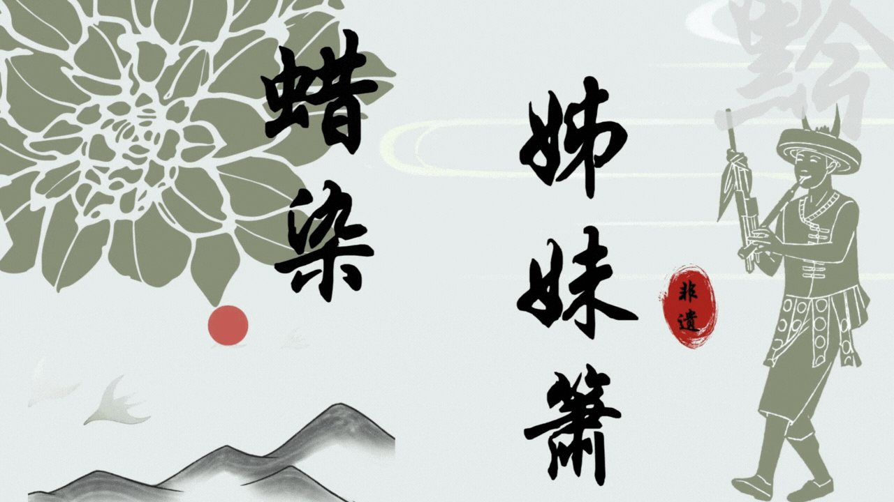
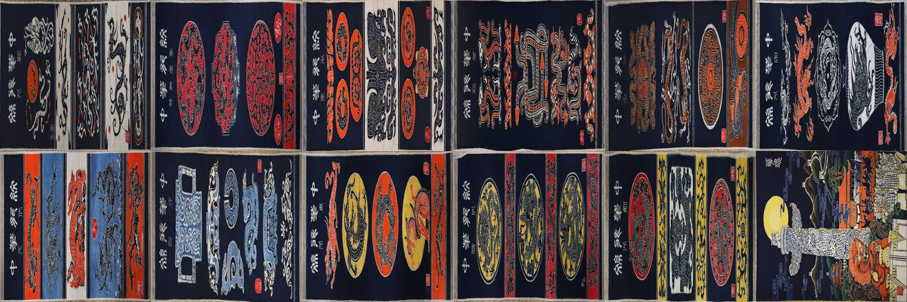
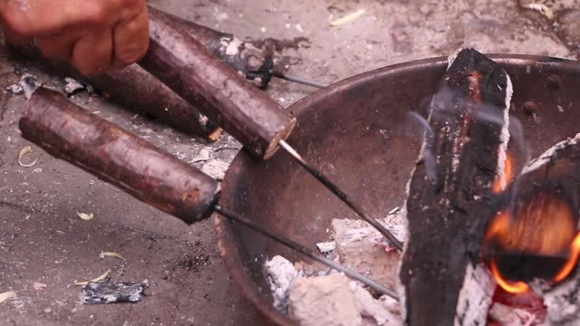
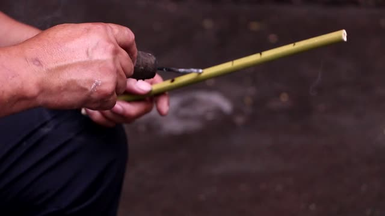
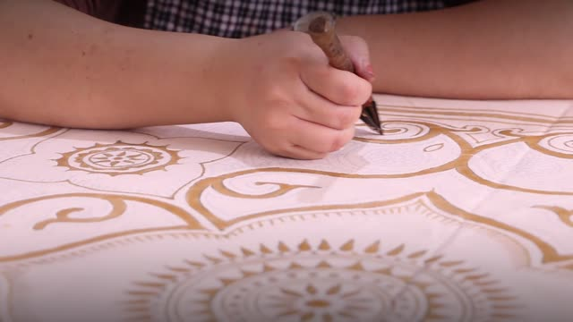
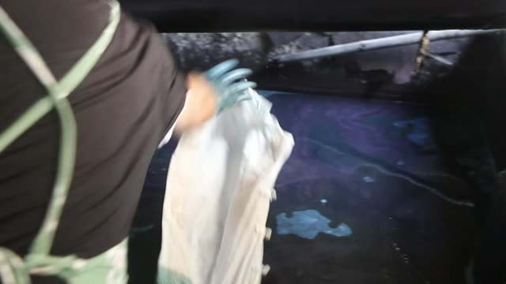
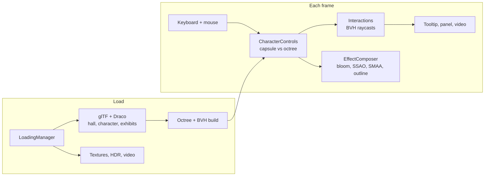

<p align="center">
  
</p>

<h1 align="center">蜡染 · 姊妹箫<br><sub>A walkable 3D gallery of Guizhou intangible heritage</sub></h1>

<p align="center">
  
  
  
  
</p>

Anshun batik and the Miao sister-flute are crafts you usually have to travel to Guizhou to see. This project puts both in a browser: you walk a character through an exhibition hall, stop in front of batik panels lit by their own spotlights, click a work to read about it, and play two short documentaries on in-hall screens.

I led the project and wrote the code during the BUPT summer social practice in 2023.

## The exhibition

<p align="center">
  
</p>
<p align="center"><sub>Twelve of the batik panels on the gallery walls, courtesy of the Anshun Batik Museum.</sub></p>

The two films play on screens inside the hall. One follows a sister-flute maker from the fire to the finished instrument; the other follows batik from wax drawing to the indigo vat.

<table>
  <tr>
    <td width="50%"></td>
    <td width="50%"></td>
  </tr>
  <tr>
    <td><sub>Heating irons over charcoal</sub></td>
    <td><sub>Shaping the holes of a finished pipe</sub></td>
  </tr>
  <tr>
    <td></td>
    <td></td>
  </tr>
  <tr>
    <td><sub>Drawing the pattern in wax</sub></td>
    <td><sub>Dyeing in indigo</sub></td>
  </tr>
</table>

## Engineering

About 3,000 lines of TypeScript on Three.js r155, organized by concern rather than in one scene file.

**Character physics that stays out of walls.** The hall geometry is loaded once into an `Octree`. Each frame the player is a `Capsule` that moves by velocity and is pushed back out along the contact normal by `capsuleIntersect`, so the character slides along walls instead of stopping dead. A fan of short raycasts around the camera stops it before it clips through thin walls.

**Raycasting that scales with the scene.** Every collidable mesh gets a bounding-volume hierarchy from `three-mesh-bvh` (`computeBoundsTree`), `Mesh.raycast` is swapped for the accelerated version, and every raycaster uses `firstHitOnly`. Picking, wall probes and video triggers all run every frame without visible cost.

**A controller with two cameras.** One controller blends idle, walk and run animations from the glTF rig, drives an orbit camera that follows the character, and switches to first person with **V** by collapsing the orbit distance. **Shift** toggles running.

**Interaction as its own module.** `interactions_v1.ts` owns the picking ray, the hover tooltip, the description panel and the proximity check for the two screens. Exhibits fade in with GSAP tweens on material opacity and spotlight power.

**Lighting and post-processing in a single pass.** HDR environment lighting, a spotlight per exhibit, and two planar mirrors (`Reflector.ts`). The `postprocessing` composer merges selective bloom (only on the exhibit spotlights), SSAO, SMAA, tone mapping and outline highlighting into one `EffectPass` after a shared normal and depth-downsampling pass. Depth of field, vignette and god rays are built and exposed in a dat.GUI panel for tuning.

**Photogrammetry assets, made light enough for a browser.** The batik panels are photogrammetry captures exported from RealityCapture, with 2K diffuse and normal maps compressed for the web. Geometry is Draco-compressed, and a `LoadingManager` holds the scene behind the animated title card until every model, texture and video is ready.



| Module | Responsibility |
|---|---|
| `main.ts` | Scene graph, asset loading, octree and BVH setup, frame loop |
| `characterControls_v2.1.ts` | Capsule physics, animation blending, third- and first-person camera |
| `interactions_v1.ts` | Picking, wall probes, tooltips, exhibit panel, video triggers |
| `postprocess.ts` | Renderer, composer and effect chain with GUI controls |
| `materials.ts`, `lights.ts`, `Reflector.ts` | PBR materials, per-exhibit lighting, planar mirrors |
| `Constraints.ts` | Exhibit metadata and layout constants |

## Run it

```bash
npm install
npm run dev
```

Open the URL Vite prints.

| Key | Action |
|---|---|
| W A S D | Walk |
| Shift | Toggle running |
| V | Switch between third and first person |
| Mouse | Look around; click a panel to read about it |
| F / G | Play the documentary / sister-flute film when the on-screen hint appears |

`public/` holds several hundred MB of models, textures and video, so the first clone takes a while.

## Repository layout

| Path | What's there |
|---|---|
| `*.ts`, `index.html`, `style.css` | The app (Vite project at the repo root) |
| `public/` | Everything the app loads at runtime |
| `assets-src/` | Source and spare assets the app does not load: the Blender file for the sister-flute model, an alternative HDR, the title animation, unused texture sets |
| `legacy/` | Earlier versions of the entry point and character controller |
| `docs/` | Images used in this README |

`npm run build` writes the production bundle to `dist/`, which is not tracked.

## Credits

Built for the BUPT summer social practice, August and September 2023. Batik works courtesy of the Anshun Batik Museum. Exhibit descriptions in `Constraints.ts` are placeholders in this snapshot.
